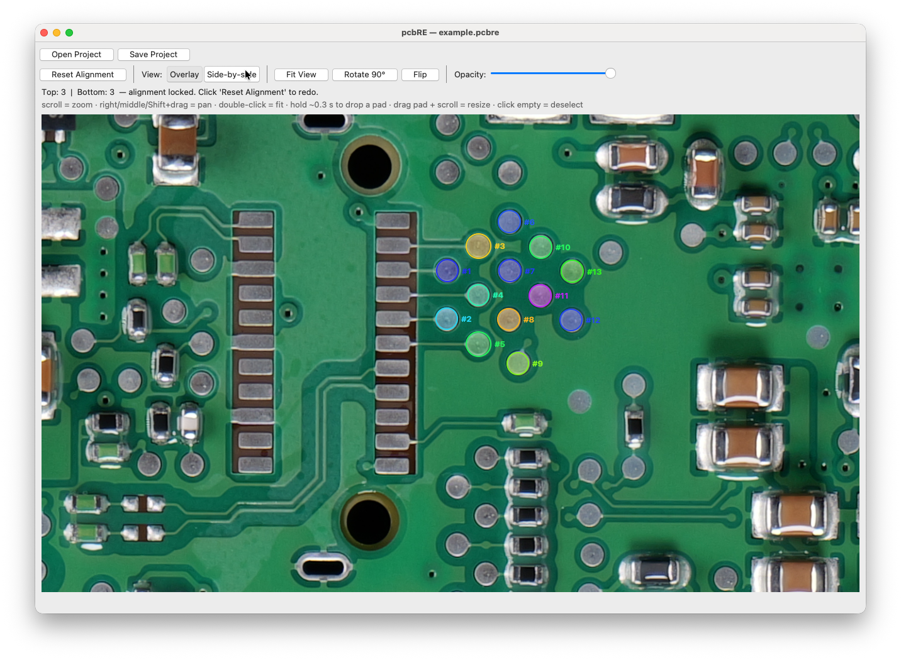

# pcbRE

**Visual reverse-engineering for printed circuit boards.**
Two photos in, labeled pads out.



---

## What

Take a top + bottom photo of a PCB. Click a handful of matching vias to lock the geometry. Now every hole on one side knows where it lands on the other — fade between them, scroll to a pad, label what it does. No CAD files, no schematic, no toolchain. Just two pictures and your eyes.

## Workflow

1. **Load Top** + **Load Bottom**, toggle **Mirror Bottom** so both sides read the same way.
2. Zoom in, click matching vias on each side. **3 pairs** → affine, **4+** → perspective homography (least-squares fit).
3. Hit **Align**. The setup toolbar collapses, side-by-side and overlay views light up.
4. **Press & hold ~0.3 s** anywhere to drop a pad. Drag, scroll while held to resize, press **E** to edit (name, description, color, opacity, size).
5. **Save Project** — image paths, alignment points, view rotation/flip, every pad → tiny `.pcbre` JSON.

## Highlights

- **Long-press placement.** Quick clicks pan; only a sustained hold drops a pad. Visual ring grows under the cursor and turns green when ready.
- **Drag + scroll = resize** for both alignment points and pads.
- **Locked alignment.** Once aligned, accidental edits are blocked. Reset asks for explicit *"I understand the risk"* if pads exist.
- **Lossless 90° rotate / horizontal flip** of the aligned overlay — pads follow.
- **Auto side-detection.** Pads are tagged TOP or BOTTOM based on which side is more visible at click time.
- **Hover tooltips** drawn directly onto the canvas (no Toplevel weirdness).
- **Editor remembers its last position** so it docks where you left it.
- **Pure numpy + Pillow + Tk.** No native deps, no installer.

## Controls

| Action | Input |
|---|---|
| Pan | right / middle / Shift+drag |
| Zoom | scroll wheel |
| Fit to window | double-click / **Fit View** |
| Place alignment point | click empty (alignment mode) |
| Resize alignment point | hold + scroll |
| Place pad | press & hold ~0.3 s, release |
| Resize pad | hold + scroll |
| Edit selected pad | **E** |
| Deselect pad | click empty |
| Save / Save As / Open | Ctrl/Cmd+S / Ctrl/Cmd+Shift+S / Ctrl/Cmd+O |

## Install

pcbRE uses [**uv**](https://docs.astral.sh/uv/) for everything. Get it once:

```bash
# macOS / Linux
curl -LsSf https://astral.sh/uv/install.sh | sh
# or with Homebrew
brew install uv
```

Then clone + install dependencies:

```bash
git clone https://github.com/lukasloetkolben/pcbRE.git
cd pcbRE
uv sync
```

`uv sync` reads `pyproject.toml`, creates a local `.venv/`, pins exact versions to `uv.lock`, and installs pcbRE itself in editable mode.

Requires **Python 3.10+**. Tk ships with the stdlib; `numpy` and `Pillow` are pulled in automatically. On macOS the system Python is fine; if uv installs a fresh Python that lacks Tk, `brew install python-tk` covers it.

## Launch

```bash
uv run pcbre
```

That's it. Equivalent forms if you prefer:

```bash
uv run python -m pcbre   # module entry
uv run python run.py     # convenience launcher
```

To grab a shell with the env active (useful for hacking):

```bash
source .venv/bin/activate
pcbre
```

## Project file

A `.pcbre` file is plain JSON with:

- `top_image` / `bot_image` — paths (relative to the project file when possible)
- `bot_mirror` — mirror state at the time of save
- `view_rotation` / `view_flipped` — overlay orientation
- `top_points` / `bot_points` — alignment correspondences (`x`, `y`, `r`)
- `pads` — every named pad (`x`, `y`, `r`, `name`, `description`, `color`, `opacity`, `side`)

Move the source images and the `.pcbre` together — paths are resolved relative to the project file.

## Files

- `pcbre/app.py` — Tk UI: zoomable canvas base, alignment panels, blended/single-source overlay views, pad editor.
- `pcbre/imageops.py` — Hartley-normalized affine + homography fit, perspective warp.
- `pcbre/__main__.py` — `python -m pcbre` entry point.
- `run.py` — standalone launcher.

## License

[MIT](LICENSE).
